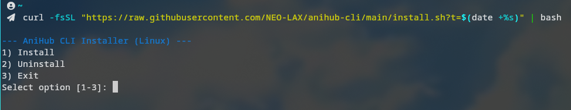

# 🎬 AniHub CLI

[](https://opensource.org/licenses/MIT)
[](https://www.rust-lang.org/)

@unofficial Terminal client for watching anime via [AniHub](https://anihub.in.ua). Built with Rust for speed and simplicity.

## 📺 Preview


---

## ✨ Features
- **Browse** the full AniHub catalog, genres, and characters.
- **Terminal Image Support** (requires a compatible terminal like Kitty, WezTerm, or Windows Terminal).
- **Smooth Playback** integrated with `mpv` and `yt-dlp`.
- **History & Caching** for quick access to your favorite titles.
- **Ukrainian Interface** support.

---

## Quick Installation preview



## 🚀 Quick Installation (Linux & macOS)

Run the following command to install the latest version automatically:

```bash
curl -fsSL "[https://raw.githubusercontent.com/NEO-LAX/anihub-cli/main/install.sh?t=$(date](https://raw.githubusercontent.com/NEO-LAX/anihub-cli/main/install.sh?t=$(date) +%s)" | bash
```

*After installation, restart your terminal or run `source ~/.bashrc` (or `source ~/.zshrc`).*

**Launch the app:**
```bash
anihub-cli
```

---

## 🪟 Windows Installation

1. Download `anihub-cli-windows.exe` from the [Latest Release](https://github.com/NEO-LAX/anihub-cli/releases/latest).
2. Rename it to `anihub-cli.exe` (optional).
3. Add the folder containing the `.exe` to your system **PATH**.
4. Ensure you have `mpv` and `yt-dlp` installed.

> **Recommendation:** Use [Windows Terminal](https://aka.ms/terminal) for the best experience.

---

## 🛠 Dependencies

To play video, you must have these installed:
- **[mpv](https://mpv.io/)** (Media player)
- **[yt-dlp](https://github.com/yt-dlp/yt-dlp)** (Video downloader/streamer)

### Install commands:

| OS | Command |
| :--- | :--- |
| **Arch Linux** | `sudo pacman -S mpv yt-dlp` |
| **Ubuntu/Debian** | `sudo apt update && sudo apt install mpv yt-dlp` |
| **macOS** | `brew install mpv yt-dlp` |
| **Windows** | `scoop install mpv yt-dlp` |

---

## 🏗 Build from Source

1. **Install Rust:** [rustup.rs](https://rustup.rs/)
2. **Clone and build:**
   ```bash
   git clone [https://github.com/NEO-LAX/anihub-cli.git](https://github.com/NEO-LAX/anihub-cli.git)
   cd anihub-cli
   cargo build --release
   ```
The binary will be located at `target/release/anihub-cli`.

---

## 📄 License
This project is licensed under the **MIT License**.
