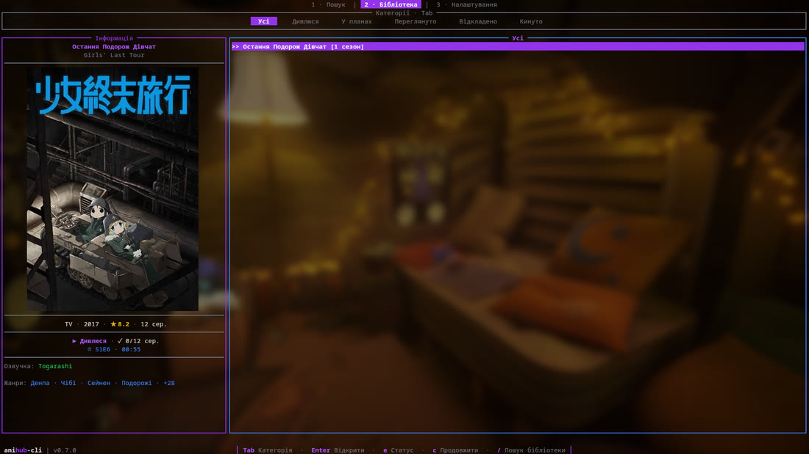
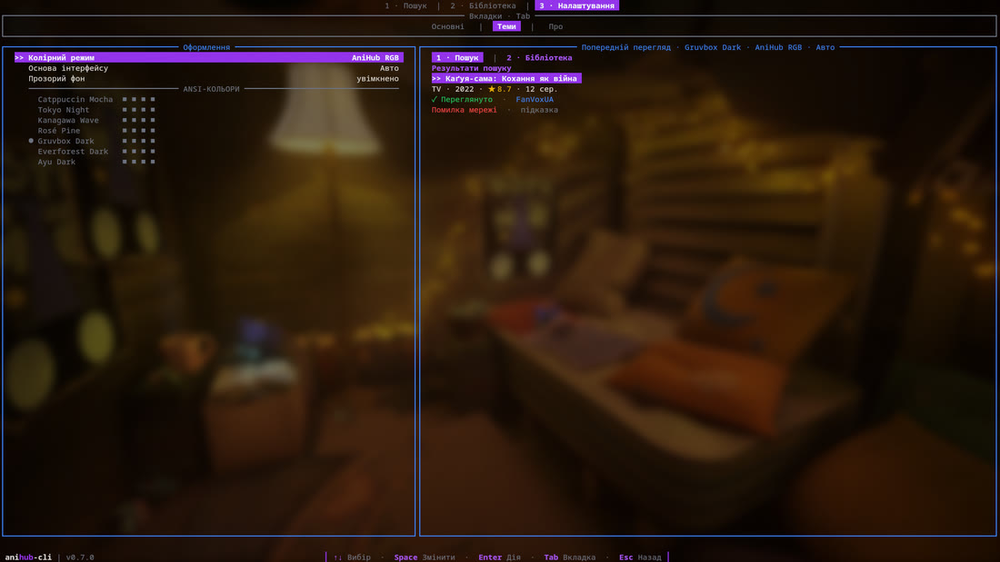
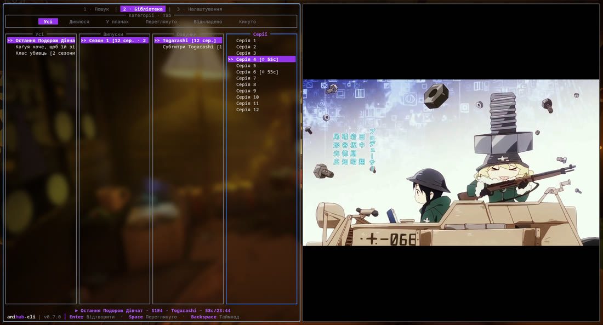
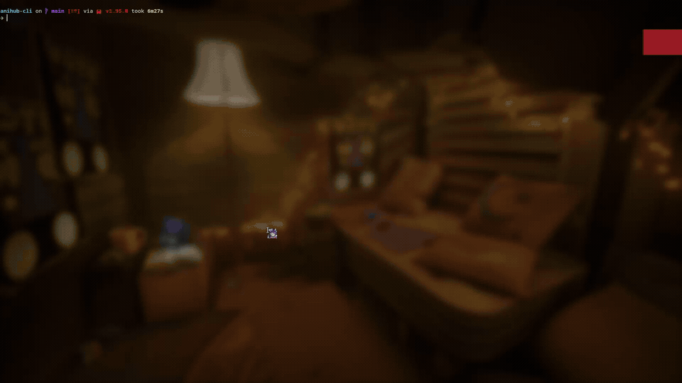
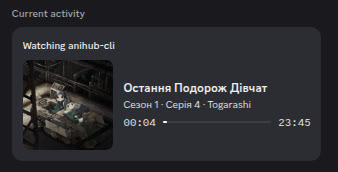
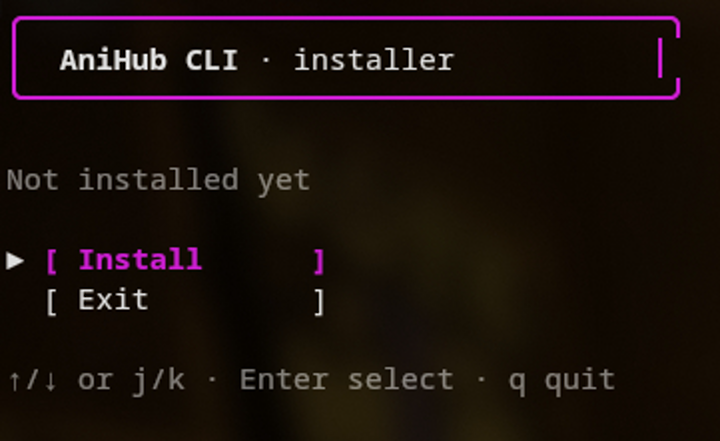

<div align="center">

# AniHub CLI

[](README.md)
[](README.uk.md)

<br/>

**Неофіційний термінальний клієнт** написаний на **Rust** 🦀  
для перегляду аніме з [**AniHub**](https://anihub.in.ua)

Український дубляж · локальна бібліотека · mpv · Discord presence

<br/>

[](https://www.rust-lang.org/)
[](LICENSE)
[](https://github.com/NEO-LAX/anihub-cli/releases/latest)
[](https://github.com/NEO-LAX/anihub-cli/releases)

</div>

---

<div align="center">

### 🎬 Від пошуку до перегляду

Шукай на AniHub, обери сезон і озвучку, натисни play — стріми відкриваються в **mpv** з нативним плейлистом.


</div>

---

<div align="center">

### 📚 Бібліотека

Статуси (Дивлюся, У планах, Переглянуто…), фільтри, resume і «продовжити перегляд».



</div>

---

<div align="center">

### 🎨 Теми

За замовчуванням оригінальна AniHub RGB. Опційно ANSI 16 / ANSI 256  
(Catppuccin, Tokyo Night, Kanagawa, Rosé Pine, Gruvbox, Everforest, Ayu…).



</div>

---

<div align="center">

### 📺 Термінал + mpv

Серії Ashdi — у **mpv** (prev / next через нативний плейлист).  
MoonAnime (лише браузер) — після підтвердження у браузері.



</div>

---

<div align="center">

### ▶️ Продовжити перегляд

Одна клавіша (`c`) — до останньої незавершеної серії.



</div>

---

<div align="center">

### 💬 Discord Rich Presence

Опційно. Назва, сезон, серія, студія, постер і progress bar як у Spotify під час play.  
На паузі бар ховається, у статусі — **Пауза**. Лише desktop Discord.



</div>

---

## ✨ Можливості

| | |
| :--- | :--- |
| 🔍 **Пошук** | Строгий (≤20) або розширений (≤100) · групування франшиз |
| 📖 **Бібліотека** | Статуси, фільтри, resume, позначка «переглянуто» |
| ▶️ **Відтворення** | Ashdi → mpv · MoonAnime → браузер · autoplay |
| 🖼 **Постери** | Kitty / iTerm2 / Sixel / halfblocks |
| 🎨 **Теми** | AniHub RGB + ANSI 16/256 · поверхні й прозорість |
| 💬 **Discord** | Rich Presence з progress bar (opt-in) |
| 💾 **Кеші** | SWR метаданих · ~150 MiB постерів із prune |
| ⌨️ **Клавіші** | Шорткати на **EN** і **UA/RU (ЙЦУКЕН)** |

> Changelog → [GitHub Releases](https://github.com/NEO-LAX/anihub-cli/releases)

---

## 📦 Встановлення

### Інтерактивний інсталер (Linux / macOS)

Меню стрілками: **Встановити · Оновити · Видалити** (опційно з даними).  
Качає бінарник із перевіркою SHA256 і безпечно мігрує локальні дані.

<div align="center">
  
</div>

```bash
curl --fail --location --retry 3 \
  https://raw.githubusercontent.com/NEO-LAX/anihub-cli/main/install.sh | bash
```

```bash
# без меню
bash -s -- update
bash -s -- uninstall          # залишити історію й налаштування
bash -s -- uninstall --purge  # стерти всі дані
```

Типовий шлях: `~/.local/bin` · змінити: `ANIHUB_INSTALL_DIR`.

### Arch Linux (AUR)

Готовий релізний бінарник:

```bash
paru -S anihub-cli-bin
# або: yay -S anihub-cli-bin
```

Якщо хочете збирати локально з коду:

```bash
paru -S anihub-cli
# або: yay -S anihub-cli
```

### Nix

```bash
nix run github:NEO-LAX/anihub-cli
# nix profile install github:NEO-LAX/anihub-cli
```

### Релізні бінарники

| Платформа | Файл |
| --- | --- |
| Linux x86_64 | `anihub-cli-x86_64-unknown-linux-gnu` |
| macOS Intel | `anihub-cli-x86_64-apple-darwin` |
| macOS Apple silicon | `anihub-cli-aarch64-apple-darwin` |
| Windows x86_64 | `anihub-cli-x86_64-pc-windows-msvc.exe` |

Windows: файл з [Releases](https://github.com/NEO-LAX/anihub-cli/releases/latest) і в `PATH`.

---

## 🔧 Залежності

- **`mpv`** у `PATH` (Ashdi)
- Сучасний термінал (зображення — опційно)
- Discord **десктоп**, якщо вмикаєте Rich Presence

```bash
# Debian / Ubuntu
sudo apt install mpv

# macOS
brew install mpv
```

---

## ⌨️ Керування

Підказки в футері. `?` або `h` — повна довідка.

| Клавіша | Дія |
| --- | --- |
| `1` `2` `3` | Пошук · Бібліотека · Налаштування |
| `/` | Пошук AniHub / фільтр бібліотеки |
| `↑` `↓` · `k` `j` | Рух по списку |
| `Enter` · `→` | Відкрити / грати |
| `Esc` · `←` | Назад (`Esc` на корені очищує результати) |
| `c` | Продовжити перегляд |
| `e` | Статус у бібліотеці |
| `Space` | Переглянуто / ні |
| `o` | У браузері |
| `r` | Повтор після мережевої помилки |
| `q` | Вийти |

Під час введення запиту цифри лишаються літерами — вкладки: `Alt`/`Ctrl` + `1`–`3`.

---

## 🗂 Налаштування та дані

| ОС | Шлях |
| --- | --- |
| Linux | `~/.local/share/anihub-cli/` |
| macOS | `~/Library/Application Support/com.shadowgarden.anihub-cli/` |
| Windows | `%LOCALAPPDATA%\shadowgarden\anihub-cli\data\` |

Файли: `settings.json`, `history.json`, кеші.  
Autoplay, resume, режим пошуку, теми, mpv, Discord, очищення постерів, перевірка оновлень (без авто-встановлення).

Для opt-in JSONL-діагностики запустіть `ANIHUB_LOG=debug anihub-cli`.
Доступні рівні: `error`, `warn`, `info`, `debug`, `trace`; за замовчуванням
логування вимкнене. Файл `logs/anihub-cli.log` лежить у теці даних і під час
запуску ротується після 2 МіБ. Пошукові запити, назви аніме та browser/stream URL
не записуються.

---

## 🛠 Збірка

Rust **1.85+**:

```bash
git clone https://github.com/NEO-LAX/anihub-cli.git
cd anihub-cli
cargo build --locked --release
```

```bash
cargo fmt --all -- --check
cargo clippy --locked --all-targets --all-features -- -D warnings
cargo test --locked --all-targets --all-features
```

---

<div align="center">

**Неофіційний** · залежить від live AniHub / джерел стрімів  
Uninstall зберігає дані, якщо не `--purge`

[MIT](LICENSE) · [Releases](https://github.com/NEO-LAX/anihub-cli/releases) · [Issues](https://github.com/NEO-LAX/anihub-cli/issues)

</div>
